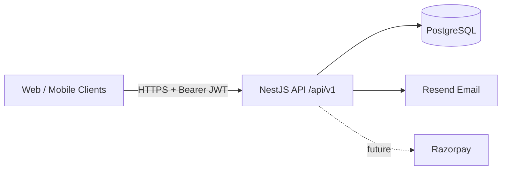

# Graphology Platform

Multi-tenant learning platform for graphology institutes — NestJS API, Next.js web app, and shared packages in a pnpm + Turborepo monorepo.

**Version:** `0.1.0` · **API:** `/api/v1` · **License:** MIT

---

## Project overview

Graphology Platform helps academies manage students, teachers, courses, and payments with organization-scoped multi-tenancy and role-based access control.

| Layer | Stack |
|-------|--------|
| API | NestJS 11, Prisma, PostgreSQL, JWT + opaque refresh tokens |
| Web | Next.js 15, React 19 |
| Tooling | pnpm 9, Turborepo, Vitest, ESLint, Prettier |
| Infra | Docker Compose, GitHub Actions |

---

## Architecture diagram



See also: [System Architecture](docs/02_SYSTEM_ARCHITECTURE.md) · [ADRs](docs/adr/README.md)

---

## Folder structure

```text
graphology-platform/
├── apps/
│   ├── api/                 # NestJS REST API
│   ├── web/                 # Next.js frontend
│   └── mobile/              # Placeholder mobile app
├── packages/
│   ├── database/            # Prisma schema, migrations, seed
│   ├── types/               # Shared TypeScript types
│   ├── ui/                  # Shared UI primitives
│   ├── utils/               # Shared utilities
│   ├── auth/                # Shared auth-related types (thin)
│   └── config/              # Shared TS/ESLint/Prettier/Tailwind config
├── docs/                    # Product & engineering docs + ADRs
├── infrastructure/          # Deployment notes
├── tests/                   # Cross-cutting / Playwright tests
└── docker-compose.yml
```

---

## Setup

### Prerequisites

- Node.js **20+**
- pnpm **9+** (`corepack enable`)
- Docker (for local PostgreSQL)

### Install

```bash
pnpm install
cp .env.example .env
# Edit .env — see docs/ENVIRONMENT.md
```

### Database

```bash
docker compose up -d postgres
pnpm --filter @graphology/database db:generate
pnpm --filter @graphology/database db:migrate
pnpm --filter @graphology/database db:seed
```

---

## Development

```bash
# All apps (Turbo)
pnpm dev

# API only (default http://localhost:3001)
pnpm --filter @graphology/api dev

# Web only (default http://localhost:3000)
pnpm --filter @graphology/web dev
```

- Swagger UI: [http://localhost:3001/api/docs](http://localhost:3001/api/docs)
- Health: [http://localhost:3001/api/v1/health](http://localhost:3001/api/v1/health)

---

## Testing

```bash
pnpm lint
pnpm typecheck
pnpm build
pnpm test

# API integration tests that hit PostgreSQL
RUN_DATABASE_TESTS=true pnpm --filter @graphology/api test
```

---

## Docker

```bash
# Full local stack (postgres + api + web)
docker compose up --build

# Postgres only (typical local API/web on host)
docker compose up -d postgres
```

Production-oriented notes: [infrastructure/README.md](infrastructure/README.md) · `docker-compose.prod.yml`

---

## Deployment

| Environment | Frontend | Backend | Database |
|-------------|----------|---------|----------|
| Development | localhost:3000 | localhost:3001 | Docker Postgres |
| Staging / Production | Vercel (planned) | Render (planned) | Neon (planned) |

Guide: [docs/08_DEPLOYMENT_GUIDE.md](docs/08_DEPLOYMENT_GUIDE.md)

---

## Roadmap

1. ~~Foundation & database~~
2. ~~Authentication & RBAC~~
3. Engineering stabilization
4. Courses, batches, enrollments
5. Dashboards (student / teacher / admin)
6. Payments & notifications
7. Google OAuth & mobile

Full list: [docs/10_FEATURE_ROADMAP.md](docs/10_FEATURE_ROADMAP.md)

---

## Screenshots

> Placeholders — replace with product screenshots when UI ships.

| Surface | Preview |
|---------|---------|
| Landing | _Coming soon_ |
| Student dashboard | _Coming soon_ |
| Admin console | _Coming soon_ |
| API Swagger | Available at `/api/docs` in development |

---

## Documentation

| Doc | Description |
|-----|-------------|
| [Environment](docs/ENVIRONMENT.md) | Required env vars |
| [API versioning](docs/API_VERSIONING.md) | `/api/v1` conventions |
| [ADRs](docs/adr/README.md) | Architecture decisions |
| [Coding standards](docs/05_CODING_STANDARDS.md) | Style & patterns |
| [Security](docs/06_SECURITY_GUIDELINES.md) | Security baseline |
| [Auth module](apps/api/src/modules/auth/README.md) | Auth & RBAC details |
| [Database package](packages/database/README.md) | Prisma ops |

---

## Contributing

1. Create a branch from `develop` (or `main` if that is your default).
2. Follow [coding standards](docs/05_CODING_STANDARDS.md) and [implementation rules](docs/prompts/IMPLEMENTATION_RULES.md).
3. Keep services free of direct Prisma access (repository pattern).
4. Run `pnpm lint`, `pnpm typecheck`, `pnpm test`, and `pnpm build` before opening a PR.
5. Use conventional commits (`feat:`, `fix:`, `docs:`, `chore:`).

---

## License

MIT — see [LICENSE](LICENSE).
