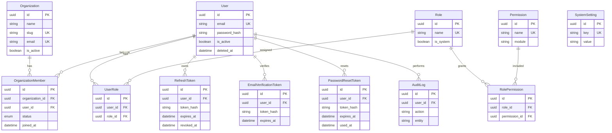

# @graphology/database

Production-ready PostgreSQL database foundation for the Graphology Platform using Prisma ORM.

## Stack

- PostgreSQL (Neon in production, Docker locally)
- Prisma ORM
- Prisma Migrate
- Zod validation for seed data
- Argon2 password hashing for seeded credentials

## Environment Variables

| Variable | Required | Description |
|----------|----------|-------------|
| `DATABASE_URL` | Yes | Primary database connection string |
| `DIRECT_URL` | Yes | Direct connection for migrations (Neon non-pooled URL) |
| `SEED_ADMIN_EMAIL` | Seed only | Initial admin email |
| `SEED_ADMIN_PASSWORD` | Seed only | Initial admin password (min 8 characters) |
| `SEED_ADMIN_FIRST_NAME` | No | Admin first name (default: System) |
| `SEED_ADMIN_LAST_NAME` | No | Admin last name (default: Administrator) |

For local development without a connection pooler, `DIRECT_URL` can match `DATABASE_URL`.

Database scripts load the monorepo root `.env` automatically.

## Schema Overview

Foundation models:

- `Organization` — multi-tenant institute / academy
- `OrganizationMember` — user membership within an organization
- `User` — identity and credentials (global; not owned by a single org)
- `Role` — RBAC roles (Admin, Teacher, Student, Parent)
- `Permission` — granular permissions
- `UserRole` — user-to-role mapping
- `RolePermission` — role-to-permission mapping
- `RefreshToken` — hashed refresh token storage (rotation + family revoke)
- `EmailVerificationToken` — hashed email verification tokens
- `PasswordResetToken` — hashed password-reset tokens
- `AuditLog` — immutable audit trail
- `SystemSetting` — platform configuration key-value store

Primary keys use UUID v7 (`@default(uuid(7))`) for time-ordered, index-friendly identifiers.

### Multi-tenant model

Users are **not** bound to a single organization via `organizationId`.

Membership is modeled through `OrganizationMember`, so a user can belong to multiple organizations.

Future business tables (courses, batches, payments, etc.) will reference `organizationId` directly.

## ER Diagram



## Development Workflow

1. Start PostgreSQL:

```bash
docker compose up -d postgres
```

2. Copy environment variables:

```bash
cp .env.example .env
```

3. Install dependencies from the repository root:

```bash
pnpm install
```

4. Generate Prisma Client:

```bash
pnpm --filter @graphology/database db:generate
```

5. Apply migrations:

```bash
pnpm --filter @graphology/database db:migrate
```

6. Seed foundation data:

```bash
pnpm --filter @graphology/database db:seed
```

7. Open Prisma Studio (optional):

```bash
pnpm --filter @graphology/database db:studio
```

## Production Workflow

1. Set `DATABASE_URL` and `DIRECT_URL` in the deployment environment.
2. Generate the Prisma Client during build:

```bash
pnpm --filter @graphology/database db:generate
```

3. Apply pending migrations:

```bash
pnpm --filter @graphology/database db:migrate:deploy
```

4. Run seed only when bootstrapping a new environment:

```bash
pnpm --filter @graphology/database db:seed
```

Never run `db:migrate:reset` in production.

## Migration history

| Migration | Purpose |
|-----------|---------|
| `20260709132845_init` | Initial foundation schema |
| `20260710083228` | Follow-up schema adjustment (legacy unnamed folder; do not rename) |
| `20260710102622_email_verification_tokens` | Email verification tokens |
| `20260710112500_password_reset_tokens` | Password reset tokens |
| `20260710164424_refresh_token_rotation` | Refresh token rotation fields |

Applied migrations must not be rewritten. New changes always get a new named migration.

## Commands

| Command | Description |
|---------|-------------|
| `db:generate` | Generate Prisma Client |
| `db:migrate` | Create and apply migrations (development) |
| `db:migrate:deploy` | Apply migrations (production/CI) |
| `db:migrate:reset` | Reset database and re-run migrations (development only) |
| `db:seed` | Seed roles, permissions, settings, org, and admin user |
| `db:studio` | Open Prisma Studio |

## Seed Data

The seed script is idempotent and seeds:

- Roles: Admin, Teacher, Student, Parent
- Permissions: `course.create`, `course.update`, `student.view`, `teacher.update`, `payment.manage`
- System settings: `site_name`, `maintenance_mode`, `support_email`, `timezone`, `currency`
- Default organization: Graphology Academy (`graphology-academy`)
- One admin user (credentials from environment variables)
- Admin membership in the default organization

Admin role receives all seeded permissions.

## Testing

```bash
pnpm --filter @graphology/database test
```

To include live database connection tests:

```bash
RUN_DATABASE_TESTS=true pnpm --filter @graphology/database test
```

## Design Principles

- UUID v7 primary keys for scalability
- Snake_case table/column names in PostgreSQL
- Soft delete via `deletedAt` on primary entities
- Multi-tenant ready via Organization + OrganizationMember
- `onDelete: Restrict` for business relationships to prevent accidental data loss
- `onDelete: SetNull` for optional audit references
- Refresh tokens stored as hashes only
